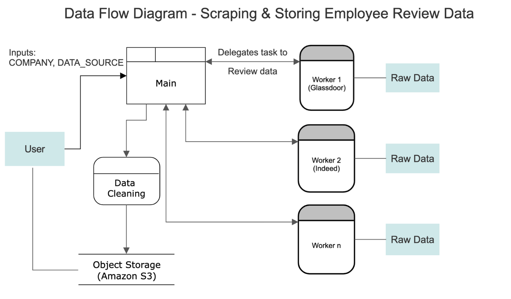
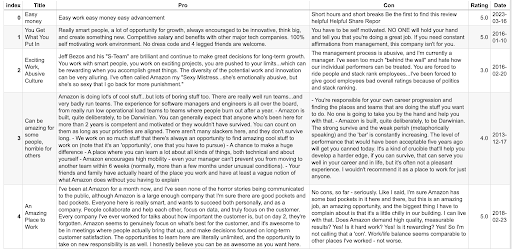

# Data Discovery - Spring 2023: Creating Employee-Reviewed Dataset
## Introduction and Motivation
- Gather employee reviews of their companies posted on online platforms
- Use this data to study how employees react to their company's pursuit of DEI policy

## Workflow

## Glassdoor version
Scrapes employee reviews on Glassdoor for a list of given company urls and stores reviews for each company in AWS S3. 
Skips company urls that have been sraped before by keeping a list in a .txt file.

Relevant files:
- **main.py**: Manager file that controls workflow; calls functions in glassdoor.py to scrape data and stores results to AWS S3
- **glassdoor.py**: Worker
- **company_url_list.txt**: A list of company urls to scrape data from
- **completed.txt**: A list of already visited company urls

## Indeed version (in progress)
This working script scrapes employee reviews on Indeed for a list of given company urls, similar to the Glassdoor version.

Relevant files:
- **indeed.py**: Modify temp_email, temp_password, and company_list to customize results

## Data Snapshot

## Resources
Link to Presentation Poster: https://docs.google.com/presentation/d/1kM98m86yW3r0mv_i2G4D7KcX2l4mFcP_v9GhMMIEO3c/edit?usp=sharing
